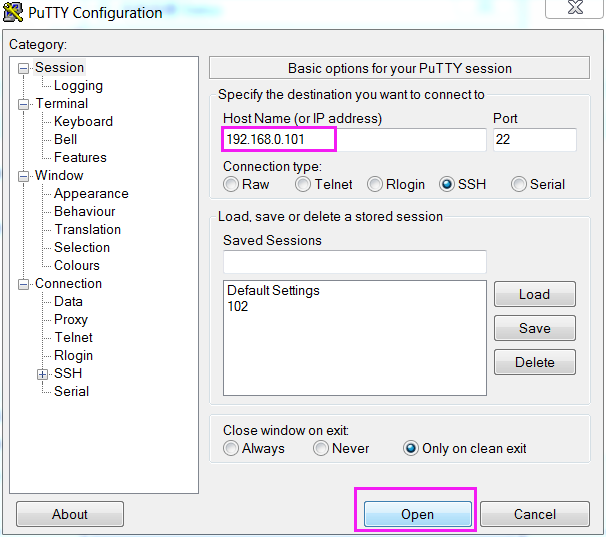

.. note::

    こんにちは、Facebook の SunFounder Raspberry Pi & Arduino & ESP32 Enthusiasts コミュニティへようこそ！  
    他のエンスージアストと一緒に、Raspberry Pi・Arduino・ESP32 の世界をさらに深く掘り下げましょう。  

    **Why Join?**

    - **Expert Support**: コミュニティやチームのサポートを受けて、購入後のトラブルや技術的課題を解決できます。  
    - **Learn & Share**: ヒントやチュートリアルを共有しながら、スキルを高めましょう。  
    - **Exclusive Previews**: 新製品の発表やプレビューにいち早くアクセスできます。  
    - **Special Discounts**: 最新製品を特別割引で入手できます。  
    - **Festive Promotions and Giveaways**: 季節のキャンペーンやプレゼント企画に参加できます。  

    👉 今すぐ参加して、一緒に創造を楽しみましょう！ [|link_sf_facebook|] をクリック！

.. _login_windows:

PuTTY
=========================

Windows ユーザーの場合、SSH クライアントアプリを利用することができます。ここでは `PuTTY <https://www.chiark.greenend.org.uk/~sgtatham/putty/latest.html>`_ を推奨します。

**Step 1**

PuTTY をダウンロードします。

**Step 2**

PuTTY を起動し、左側のツリー状メニューから **Session** を選択します。  
**Host Name (or IP address)** に Raspberry Pi の IP アドレスを入力し、 **Port** に **22** （デフォルト値）を入力します。

**Step 3**

**Open** をクリックします。初回ログイン時にはセキュリティ警告が表示されますが、 **Yes** をクリックしてください。

**Step 4**

PuTTY ウィンドウに「 **login as:** 」と表示されたら、ユーザー名として「 **pi** 」を入力し、続けて **password** として「raspberry」（変更していない場合のデフォルト）を入力します。

.. note::

    パスワード入力時に文字が表示されないのは正常な仕様です。正しく入力してください。  
    
    PuTTY のウィンドウに「inactive」と表示された場合、接続が切断されたことを意味し、再接続が必要です。  
    
.. image:: img/image26.png
    :align: center

**Step 5**

これで Raspberry Pi に接続できました。次のステップに進みましょう。