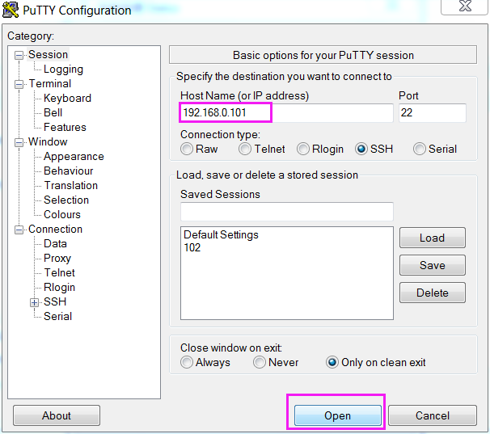
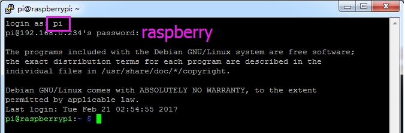

.. include:: /index.rst
   :start-after: start_hello_message
   :end-before: end_hello_message

.. _login_windows:

PuTTY
=========================

Wenn du Windows verwendest, kannst du für SSH verschiedene Anwendungen nutzen. Hier empfehlen wir `PuTTY <https://www.chiark.greenend.org.uk/~sgtatham/putty/latest.html>`_.  

**Schritt 1**

Lade PuTTY herunter.  

**Schritt 2**

Öffne PuTTY und klicke in der linken Baumstruktur auf **Sitzung(Session)**. Gib im Textfeld unter **Host Name (oder IP address)** die IP-Adresse deines RPi ein und trage bei **Port** den Wert **22** ein (Standard-Port ist 22).  

**Schritt 3**

Klicke auf **Öffnen(Open)**. Beim ersten Login auf dem Raspberry Pi über die IP-Adresse erscheint ein Sicherheitshinweis. Bestätige diesen mit **Yes**.  

**Schritt 4**

Wenn das PuTTY-Fenster nach „ **login as:** “ fragt, gib „ **pi** “ ein (den Standard-Benutzernamen des RPi) und als **password** „raspberry“ (sofern du es nicht geändert hast).  

.. note::

    Während der Passworteingabe werden keine Zeichen im Fenster angezeigt – das ist normal. Wichtig ist, dass du das Passwort korrekt eintippst.  

    Falls neben PuTTY „inactive“ angezeigt wird, bedeutet das, dass die Verbindung unterbrochen wurde und neu aufgebaut werden muss.  

**Schritt 5**

Nun ist dein Raspberry Pi verbunden, und du kannst mit den nächsten Schritten fortfahren.  
