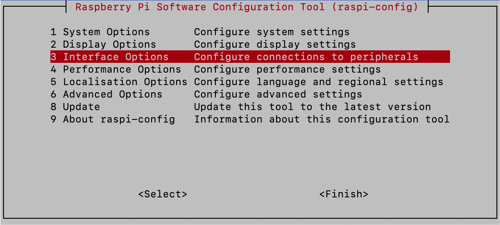
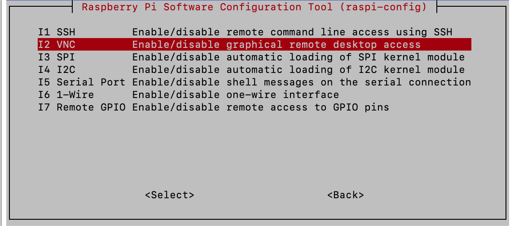
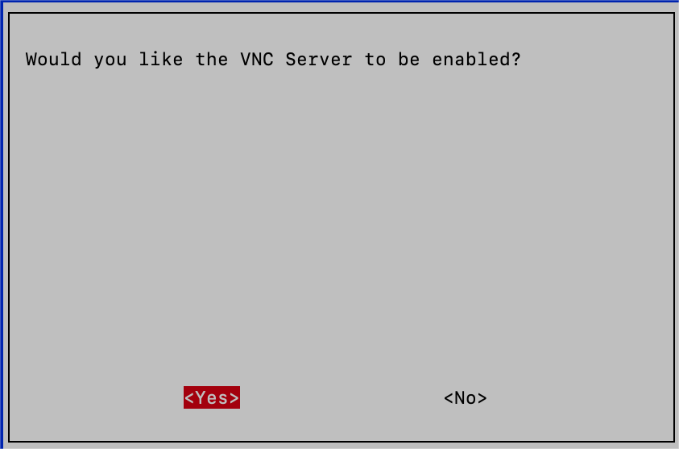
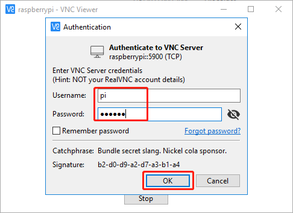
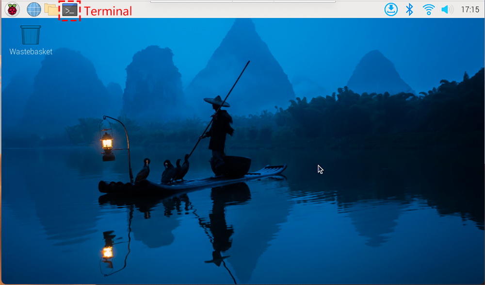

.. note::

    こんにちは、Facebook の SunFounder Raspberry Pi & Arduino & ESP32 Enthusiasts コミュニティへようこそ！  
    他のエンスージアストと一緒に、Raspberry Pi・Arduino・ESP32 の世界をさらに深く探求しましょう。  

    **なぜ参加するのか？**  

    - **専門的なサポート**: コミュニティやチームのサポートを受けて、購入後のトラブルや技術的な課題を解決できます。  
    - **学び＆共有**: ヒントやチュートリアルを共有し、スキルを磨きましょう。  
    - **限定プレビュー**: 新製品の発表や先行プレビューを誰よりも早くチェックできます。  
    - **特別割引**: 最新製品を特別割引価格で入手できます。  
    - **季節限定プロモーションとプレゼント企画**: 季節ごとのキャンペーンやプレゼント企画に参加できます。  

    👉 今すぐ参加して、一緒にものづくりを楽しみましょう！ [|link_sf_facebook|] をクリック！

.. _remote_desktop:

# ラズベリーパイのリモートデスクトップアクセス
=====================================================

コマンドラインよりもグラフィカルユーザーインターフェース（GUI）を好む方のために、Raspberry Pi にはリモートデスクトップ機能が用意されています。
このガイドでは、VNC（Virtual Network Computing）を使ったリモートアクセスの設定と利用方法を解説します。

この目的には `VNC® Viewer <https://www.realvnc.com/en/connect/download/viewer/>`_ の使用を推奨します。

**Raspberry Pi で VNC サービスを有効にする**

Raspberry Pi OS には VNC サービスがプリインストールされていますが、初期状態では無効化されています。以下の手順で有効化してください。

#. Raspberry Pi のターミナルで次のコマンドを入力します:

.. raw:: html  

    <run></run>  

.. code-block::  

    sudo raspi-config  

#. 矢印キーで **インターフェースオプション（Interfacing Options）** に移動し、 **Enter（エンター）** を押します。

#. オプションの中から **VNC** を選択します。

#. 矢印キーで **<はい（Yes）>** -> **<OK>** -> **<完了（Finish）>** を選択し、VNC サービスの有効化を完了します。

**VNC ビューアーでログインする**

#. パソコンに `VNC Viewer <https://www.realvnc.com/en/connect/download/viewer/>`_ をダウンロードしてインストールします。

#. インストール後、VNC Viewer を起動し、Raspberry Pi のホスト名または IP アドレスを入力して **Enter（エンター）** を押します。

.. image:: img/vnc_viewer1.png  
    :align: center  

#. ユーザー名とパスワードの入力を求められたら入力し、 **OK（オーケー）** をクリックします。

#. 数秒後に Raspberry Pi OS のデスクトップが表示されます。ここからターミナルを開いてコマンドを入力できます。

