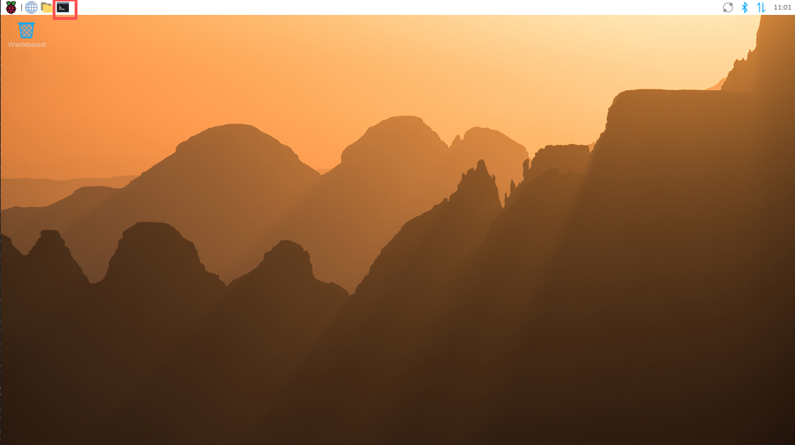

.. include:: /index.rst
   :start-after: start_hello_message
   :end-before: end_hello_message

.. _install_driver_rapios:

Install 3.5'' IPS Screen Driver on Raspberry Pi OS
=========================================================

This section explains how to install the 3.5'' IPS screen driver on **Raspberry Pi OS**.  
You can access your Raspberry Pi either with a monitor or via SSH (headless), and then install the driver to enable the screen.

If You Have a Screen
-------------------------

**Required Components**

* Raspberry Pi
* Official Power Supply
* MicroSD Card
* HDMI Cable  
  (For Raspberry Pi 4/5, use **HDMI0**, the port nearest the power connector.)
* Monitor
* Keyboard and Mouse

**Steps**

#. Insert the microSD card into your Raspberry Pi.
#. Connect the keyboard, mouse, and monitor.
#. Power on your Raspberry Pi.
#. After booting, the Raspberry Pi OS desktop will appear. 

   .. image:: img/plug_screen_trixie.png
      :width: 80%
      :align: center

#. Open a **Terminal** to enter commands.

   .. image:: img/open_terminal.png
      :width: 80%
      :align: center

If You Have No Screen (Headless)
----------------------------------

Without a monitor, you can configure and log in to your Raspberry Pi remotely.  
This is the most convenient method for most users.

**Required Components**

* Raspberry Pi
* Official Power Supply
* MicroSD Card
* A computer on the same network

**Tips**

* Make sure you have completed all settings described in :ref:`imager_custom` when installing the system with Raspberry Pi Imager.
* Ensure that your Raspberry Pi and your computer are on the same local network.
* For best stability, use Ethernet if available.

**Connect via SSH**

#. Open a terminal on your computer (Windows: **PowerShell**; macOS/Linux: **Terminal**) and connect to your Raspberry Pi:

   .. code-block:: bash

      ssh <username>@<hostname>.local
      # Example:
      ssh daisy@pi.local

2. Alternatively, locate your Pi’s IP address from your router’s DHCP list and connect with:

   .. code-block:: bash

      ssh <username>@<IP address>
      # Example:
      ssh daisy@192.168.1.42

3. On first login, type ``yes`` to confirm the SSH certificate.

4. Enter the password you configured in Raspberry Pi Imager.  
   (Nothing appears while typing—this is normal.)

5. After login, you now have full command-line access.

   .. image:: img/ssh_login.png
      :align: center

--------------------------------------

Graphical Remote Access (Optional)
----------------------------------------

If you prefer a graphical interface:

* :ref:`remote_desktop` — Use **VNC** for full desktop access
* |link_rpi_connect| — Use **Raspberry Pi Connect** via browser

--------------------------------------

Install 3.5'' IPS Screen Driver (Important)
--------------------------------------------------

This is the key step to enable the 3.5'' IPS screen.

Run the following commands:

.. code-block:: shell

   sudo rm -rf LCD-show
   git clone https://github.com/sunfounder/LCD-show.git
   chmod -R 755 LCD-show
   cd LCD-show/
   sudo ./MHS35IPS-show

After installation:

* Disconnect the HDMI monitor. 
* After rebooting, the system will be displayed on the 3.5'' IPS screen.

Rotate the Display
-----------------------------

You can rotate the display and touch orientation by running:

.. code-block:: shell

    cd LCD-show/
    sudo ./rotate.sh 90

The system will reboot automatically. After restart, the screen and touch orientation will be rotated to **90°**.  
You can replace ``90`` with ``0``, ``180``, or ``270`` to set the desired rotation.
