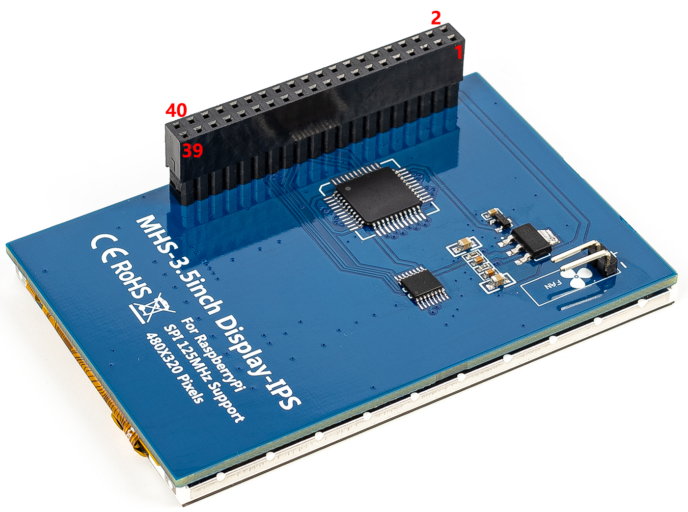
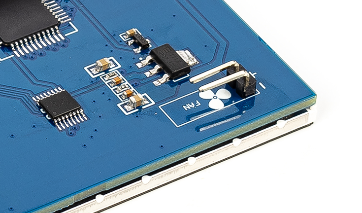

.. note::

    こんにちは、Facebook の SunFounder Raspberry Pi & Arduino & ESP32 Enthusiasts コミュニティへようこそ！  
    他の愛好者と一緒に Raspberry Pi、Arduino、ESP32 の世界をさらに深く探求しましょう。  

    **なぜ参加するのか？**  

    - **専門的なサポート**: コミュニティやチームのサポートを受けて、購入後のトラブルや技術的な課題を解決できます。  
    - **学び＆共有**: ヒントやチュートリアルを共有し、スキルを磨きましょう。  
    - **限定プレビュー**: 新製品の発表や先行プレビューを誰よりも早くチェックできます。  
    - **特別割引**: 最新製品を特別割引価格で入手できます。  
    - **季節限定プロモーションとプレゼント企画**: 季節ごとのキャンペーンやプレゼント企画に参加できます。  

    👉 さあ、一緒に学び、創造を楽しみましょう！ [|link_sf_facebook|] をクリックして今すぐ参加してください！

ハードウェアの説明
===========================

**パラメーター（Parameters）**

.. list-table::
    :header-rows: 1

    * - パラメーター
      - 説明
    * - 画面サイズ
      - 3.5インチ
    * - LCDタイプ
      - IPS
    * - 視野角
      - 全視野角
    * - モジュールインターフェース
      - SPI（最大125MHz SPI入力対応）
    * - 解像度
      - 320×480（ピクセル）
    * - ピン数
      - 40ピン（Raspberry Piと同じ）
    * - 色数
      - 65K
    * - タッチスクリーンコントローラー
      - XPT2046
    * - LCDドライバIC
      - ST7796U
    * - バックライト
      - LED
    * - 消費電力
      - 0.16A × 5V
    * - 動作温度（℃）
      - -20 ～ 60
    * - アクティブエリア
      - 48.96 × 73.44 (mm)
    * - モジュール基板サイズ
      - 85.42 × 55.60 (mm)
    * - パッケージサイズ
      - 132 × 96 × 40 (mm)
    * - 製品重量（パッケージ含む）
      - 93.8 g

**インターフェース定義（Interface Definition）**

以下は 3.5 インチ IPS スクリーンのピン配置図です。実際に接続されているのは最初の 26 ピンのみで、27〜40 ピンは未接続です。これらは最新の 40 ピン Raspberry Pi モデルとの互換性を保つため、また誤挿入を防ぐために用意されています。

.. list-table:: 
    :header-rows: 1

    * - PIN NO.
      - シンボル  
      - 説明
    * - 1, 17
      - 3.3V
      - 電源入力（3.3V）
    * - 2, 4
      - 5V
      - 電源入力（5V）
    * - 3, 5, 7, 8, 10, 12, 13, 15, 16, 27~40
      - NC
      - 未接続
    * - 6, 9, 14, 20, 25
      - GND
      - グランド
    * - 11
      - TP_IRQ
      - タッチパネル割り込み信号、押下時に Low
    * - 18
      - LCD_RS
      - LCD レジスタ選択信号（Low: コマンド、High: データ）
    * - 19
      - LCD_SI / TP_SI
      - LCD 表示/タッチパネル用 SPI データ入力
    * - 21
      - TP_SO
      - タッチパネルからの SPI データ出力
    * - 22
      - RST
      - リセット信号、Low で有効
    * - 23
      - LCD_SCK / TP_SCK
      - LCD 表示/タッチパネル用 SPI クロック信号
    * - 24
      - LCD_CS
      - LCD チップセレクト信号、Low で有効
    * - 26
      - TP_CS
      - タッチパネルチップセレクト信号、Low で有効

**ファンピン（Fan Pins）**

スクリーン背面には外部ファンを接続できる 2 つのファン用ピンが搭載されています。ただし、一度接続するとファンは常時回転し、コードによる制御はできません。

  
