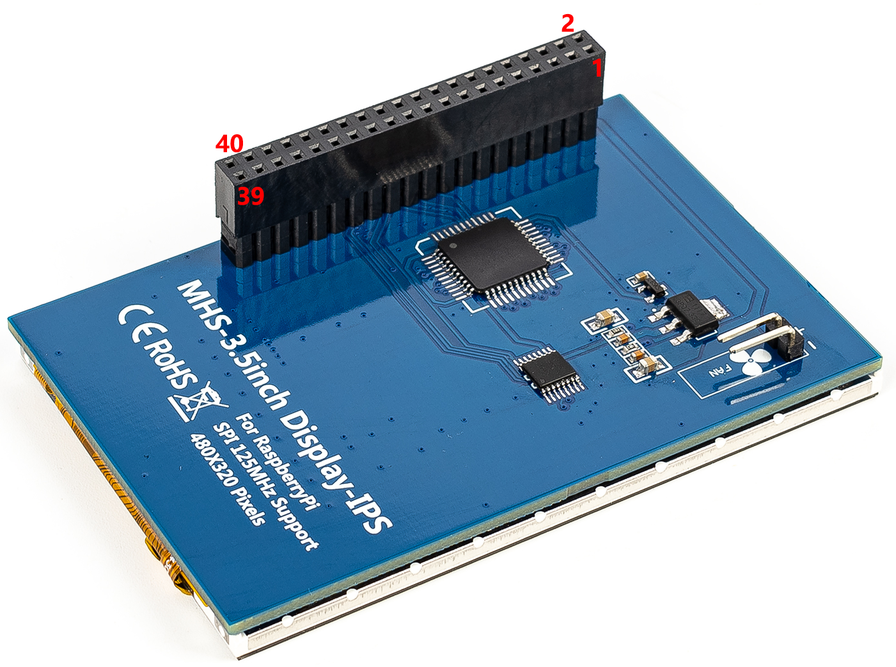
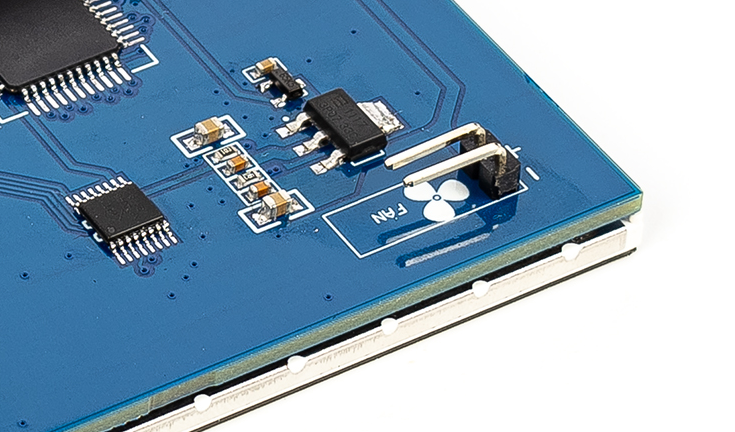

.. include:: /index.rst
   :start-after: start_hello_message
   :end-before: end_hello_message

ハードウェア仕様
===========================

**仕様一覧**

.. list-table::
    :header-rows: 1

    * - 項目
      - 説明
    * - 画面サイズ
      - 3.5インチ
    * - LCDタイプ
      - IPS
    * - 視野角
      - 全視野角
    * - モジュールインターフェース
      - SPI（最大125MHzのSPI入力に対応）
    * - 解像度
      - 320×480（ピクセル）
    * - ピン数
      - 40ピン（Raspberry Piと同一）
    * - 色数
      - 65K色
    * - タッチスクリーンコントローラ
      - XPT2046
    * - LCDドライバIC
      - ST7796U
    * - バックライト
      - LED
    * - 消費電力
      - 0.16A × 5V
    * - 動作温度（℃）
      - -20 ～ 60
    * - 表示領域
      - 48.96 × 73.44（mm）
    * - モジュール基板サイズ
      - 85.42 × 55.60（mm）
    * - パッケージサイズ
      - 132 × 96 × 40（mm）
    * - 製品重量（パッケージ含む）
      - 93.8 g

**インターフェース定義**

以下は3.5インチIPSスクリーンのピン配置図です。実際に接続されているのは最初の26ピンのみで、27～40ピンは未接続です。これらは40ピン仕様のRaspberry Piとの互換性を保ち、誤挿入を防ぐために用意されています。

.. list-table:: 
    :header-rows: 1

    * - ピン番号
      - シンボル
      - 説明
    * - 1, 17
      - 3.3V
      - 電源入力（3.3V）
    * - 2, 4
      - 5V
      - 電源入力（5V）
    * - 3, 5, 7, 8, 10, 12, 13, 15, 16, 27～40
      - NC
      - 未接続
    * - 6, 9, 14, 20, 25
      - GND
      - グラウンド
    * - 11
      - TP_IRQ
      - タッチパネル割り込み信号（押下時にLow）
    * - 18
      - LCD_RS
      - LCDレジスタ選択信号（Low：コマンド、High：データ）
    * - 19
      - LCD_SI / TP_SI
      - LCD表示／タッチパネル用SPIデータ入力
    * - 21
      - TP_SO
      - タッチパネルからのSPIデータ出力
    * - 22
      - RST
      - リセット信号（Lowアクティブ）
    * - 23
      - LCD_SCK / TP_SCK
      - LCD表示／タッチパネル用SPIクロック信号
    * - 24
      - LCD_CS
      - LCDチップセレクト信号（Lowアクティブ）
    * - 26
      - TP_CS
      - タッチパネルチップセレクト信号（Lowアクティブ）

**ファン用ピン**

スクリーン背面には外部ファンを接続するための2つのピンがあります。ただし、ファンを接続すると常時回転し、ソフトウェアでの制御はできません。

