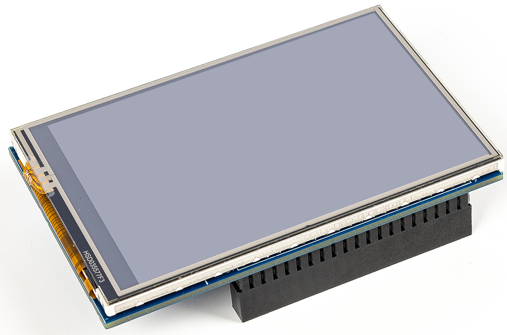

.. note::

    Hello, welcome to the SunFounder Raspberry Pi & Arduino & ESP32 Enthusiasts Community on Facebook! Dive deeper into Raspberry Pi, Arduino, and ESP32 with fellow enthusiasts.

    **Why Join?**

    - **Expert Support**: Solve post-sale issues and technical challenges with help from our community and team.
    - **Learn & Share**: Exchange tips and tutorials to enhance your skills.
    - **Exclusive Previews**: Get early access to new product announcements and sneak peeks.
    - **Special Discounts**: Enjoy exclusive discounts on our newest products.
    - **Festive Promotions and Giveaways**: Take part in giveaways and holiday promotions.

    👉 Ready to explore and create with us? Click [|link_sf_facebook|] and join today!

3.5-inch 480x 320 IPS Touch Screen
==============================================

The 3.5-inch 480×320 IPS Touch Screen delivers wide viewing angles, rich 65K colors, and responsive touch control. Designed for the Raspberry Pi, it connects directly via GPIO—no extra cables required—and supports Raspberry Pi OS, Ubuntu, Kali Linux, and RetroPie (driver installation required). Perfect for DIY projects and compact embedded applications.

**Features**

* 320×480 Resolution – Clear and detailed display for compact projects.
* IPS Technology – Wide viewing angles with vibrant, accurate colors.
* High-Speed SPI (up to 125 MHz, 50 FPS) – Smooth and responsive display performance.
* Resistive Touch Control – Reliable and precise touch input.
* 40-Pin GPIO Interface – Simple, foolproof connection to Raspberry Pi.
* Broad Compatibility – Works with Raspberry Pi 5, 4B, 3B and Zero 2 W.
* Multiple OS Support – Compatible with Raspberry Pi OS, Ubuntu, Kali Linux, and RetroPie (driver installation required and included).
* Perfect Fit for Raspberry Pi – Compact design aligned with the Pi’s dimensions.

.. toctree::
    :maxdepth: 2
    
    About this Kit <self>
    hardware_introduction
    install_setup_os/install_setup_os
    quick_user_guide
    compatible_os
    faq

Copyright Notice
--------------------------

All contents including but not limited to texts, images, and code in this manual are owned by the SunFounder Company. You should only use it for personal study,investigation, enjoyment, or other non-commercial or nonprofit purposes, under therelated regulations and copyrights laws, without infringing the legal rights of the author and relevant right holders. For any individual or organization that uses these for commercial profit without permission, the Company reserves the right to take legal action.

