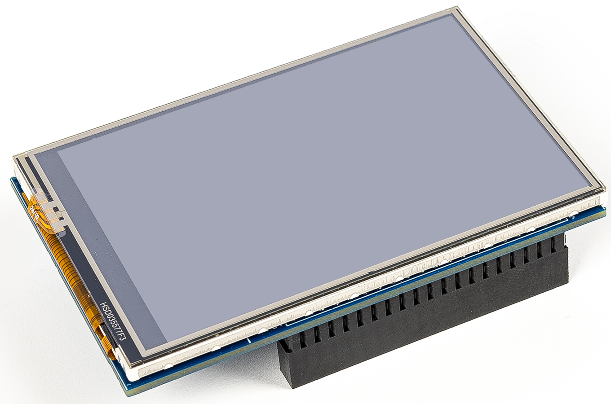

.. start_hello_message

.. note::

    こんにちは。SunFounderのRaspberry Pi・Arduino・ESP32愛好者向けFacebookコミュニティへようこそ！  
    Raspberry Pi、Arduino、ESP32を仲間と一緒により深く学びましょう。

    **参加するメリット**

    - **専門サポート**：購入後の問題や技術的な課題を、コミュニティやサポートチームと一緒に解決できます。
    - **学びと共有**：ノウハウやチュートリアルを共有し、スキルアップできます。
    - **先行情報の入手**：新製品の情報やプレビューをいち早くチェックできます。
    - **限定割引**：最新製品を特別価格で購入できます。
    - **キャンペーン＆プレゼント企画**：イベントや抽選企画に参加できます。

    👉 一緒にものづくりを楽しみませんか？ [|link_sf_facebook|] をクリックして今すぐ参加！

.. end_hello_message

3.5インチ 480×320 IPS タッチスクリーン
==============================================

この3.5インチ 480×320 IPSタッチスクリーンは、広い視野角、豊かな65Kカラー、高い応答性のタッチ操作を実現します。  
Raspberry Pi向けに設計されており、GPIOに直接接続できるため追加のケーブルは不要です。Raspberry Pi OS、Ubuntu、Kali Linux、RetroPieに対応しています（ドライバーのインストールが必要）。  
DIYプロジェクトやコンパクトな組み込み用途に最適です。

**特長**

* 320×480解像度 – コンパクトなプロジェクトでも鮮明で詳細な表示。
* IPS方式 – 広視野角で鮮やかかつ正確な色表現。
* 高速SPI（最大125MHz、50FPS） – 滑らかで応答性の高い表示性能。
* 抵抗膜式タッチ – 安定した正確なタッチ入力。
* 40ピンGPIOインターフェース – Raspberry Piへ簡単・確実に接続。
* 幅広い互換性 – Raspberry Pi 5、4B、3B/3B+、Zero 2Wに対応。
* 複数OS対応 – Raspberry Pi OS、Ubuntu、Kali Linux、RetroPieに対応（ドライバー付属・インストールが必要）。
* Raspberry Piに最適設計 – Pi本体サイズに合わせたコンパクト設計。

.. note::

   3.5インチIPSスクリーンドライバーをインストール後は、HDMIモニターを取り外すことを推奨します。

   HDMIモニターを接続したままにすると、画面が表示されない、または黒画面になる場合があります。

.. toctree::
    :maxdepth: 2
    
    About this Kit <self>
    get_started/get_started
    hardware_introduction
    appendix/appendix
    faq

著作権について
--------------------------

本マニュアルに含まれるすべての内容（文章、画像、コード等を含むがこれらに限らない）は、SunFounder社に帰属します。  
個人の学習、研究、趣味など非営利目的に限り、関連法規および著作権法の範囲内で利用することができます。著作者および権利者の正当な権利を侵害してはなりません。  
無断で商用利用を行った場合、当社は法的措置を講じる権利を有します。