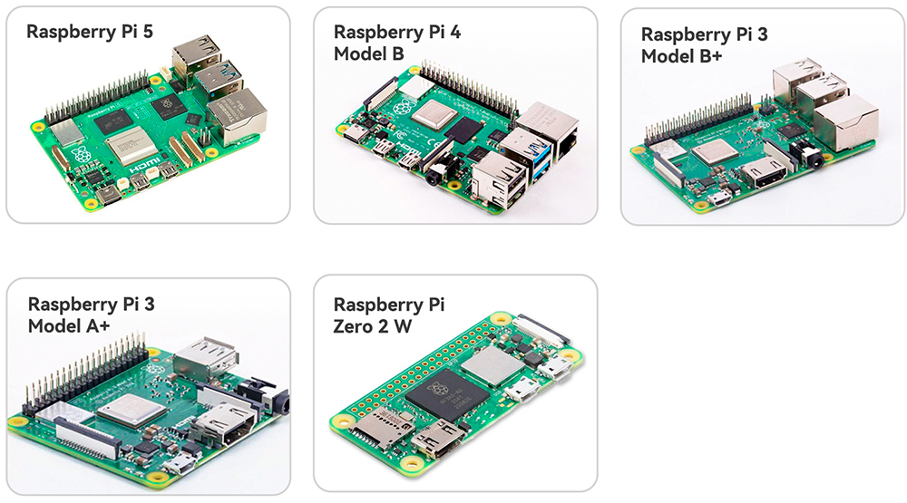

.. note::

    Hello, welcome to the SunFounder Raspberry Pi & Arduino & ESP32 Enthusiasts Community on Facebook! Dive deeper into Raspberry Pi, Arduino, and ESP32 with fellow enthusiasts.

    **Why Join?**

    - **Expert Support**: Solve post-sale issues and technical challenges with help from our community and team.
    - **Learn & Share**: Exchange tips and tutorials to enhance your skills.
    - **Exclusive Previews**: Get early access to new product announcements and sneak peeks.
    - **Special Discounts**: Enjoy exclusive discounts on our newest products.
    - **Festive Promotions and Giveaways**: Take part in giveaways and holiday promotions.

    👉 Ready to explore and create with us? Click [|link_sf_facebook|] and join today!

What Do We Need?
========================

Required Components
-----------------------

**Raspberry Pi**

The Raspberry Pi is a low cost, credit-card sized computer that plugs
into a computer monitor or TV, and uses a standard keyboard and mouse.
It is a capable little device that enables people of all ages to explore
computing, and to learn how to program in languages like Scratch and
Python.

**Power Adapter**

  It is recommended to use a **5V 3A power supply**, such as the official **Raspberry Pi 15W USB-C adapter**. You may also use a **USB-C Power Delivery (PD) charger** or a **QC 2.0 fast charger**.

**Micro SD Card**

  The Raspberry Pi does not have a built-in hard drive. It boots and stores all files on a **Micro SD card**.  
  
  * Minimum: **16GB**  
  * Recommended: **32GB** for better stability  
  * Brand: Use reliable options such as **SanDisk** or **Samsung** to avoid read/write errors  

Optional Components
-------------------------

Although not strictly required, the following peripherals will greatly improve your learning and debugging experience:

* **Monitor (HDMI or TV)** 

  For beginners, we strongly recommend a display with an HDMI input, so you can easily configure OS and run graphical programs.  

* **HDMI Cable (Standard / Mini / Micro)**
 
  Different Raspberry Pi models use different HDMI connectors, be sure to check your Pi model and prepare the correct cable. 
  
  * **Raspberry Pi 4 / 5**: Micro HDMI  
  * **Raspberry Pi 3**: Standard HDMI  
  * **Raspberry Pi Zero 2W**: Mini HDMI 

* **Keyboard & Mouse**

  Very useful during the initial setup. Later, you may switch to remote access (SSH/VNC), but for beginners we recommend preparing a basic USB or wireless set.  

