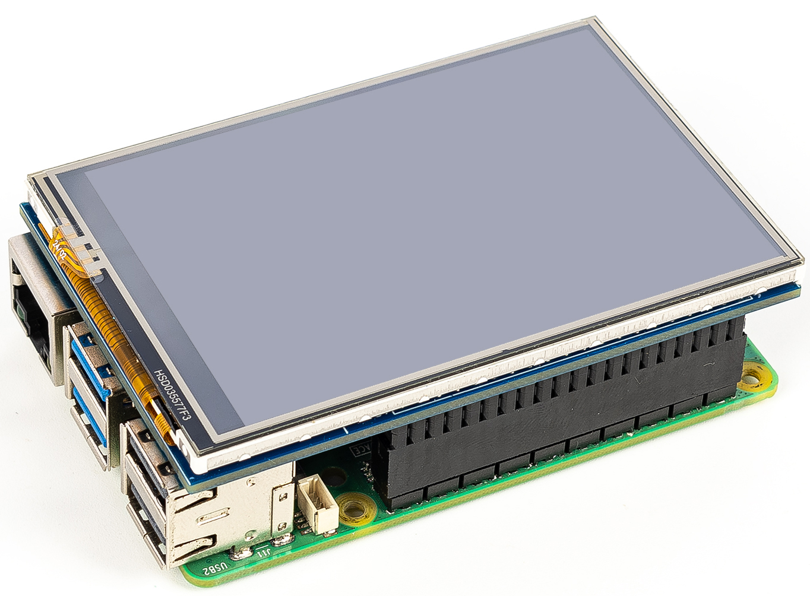

.. note::

    Hello, welcome to the SunFounder Raspberry Pi & Arduino & ESP32 Enthusiasts Community on Facebook! Dive deeper into Raspberry Pi, Arduino, and ESP32 with fellow enthusiasts.

    **Why Join?**

    - **Expert Support**: Solve post-sale issues and technical challenges with help from our community and team.
    - **Learn & Share**: Exchange tips and tutorials to enhance your skills.
    - **Exclusive Previews**: Get early access to new product announcements and sneak peeks.
    - **Special Discounts**: Enjoy exclusive discounts on our newest products.
    - **Festive Promotions and Giveaways**: Take part in giveaways and holiday promotions.

    👉 Ready to explore and create with us? Click [|link_sf_facebook|] and join today!

Quick User Guide
===========================

1. Install the Operating System
--------------------------------------

Use **Raspberry Pi Imager** to install the operating system that matches your Raspberry Pi board model.

For detailed instructions, please refer to :ref:`install_os`.

.. note::

    * **Raspberry Pi OS**: If you are using a Raspberry Pi 3, 2, 1, Zero, or Zero 2W, you must install the Bullseye instead of Bookworm to ensure the display functions properly.
    * **Other Operating Systems**: Follow the instructions provided in Raspberry Pi Imager to install the OS recommended for your specific Raspberry Pi model.

2. Connect the Display to the Raspberry Pi
-----------------------------------------------

This 3.5-inch IPS display shares the same pinout as the Raspberry Pi.

**Steps**: 

1. Power off your Raspberry Pi and unplug the power cable.  
2. Align the display with the GPIO header (Pin 1 alignment) and firmly press it onto the pins.  
3. Insert the prepared MicroSD card and power on the Raspberry Pi.

.. _install_driver:

3. Driver Installation
-------------------------------

This 3.5-inch IPS Screen requires a driver before use. The installation steps vary depending on the operating system.

The 3.5-inch IPS display requires drivers before it can function. Depending on your operating system, follow the instructions below.

.. note::

    You will need to either remotely log in to your Raspberry Pi or connect an additional plug-and-play monitor to install the drivers. Only after installation will the 3.5-inch display function properly.

    For detailed instructions, please refer to :ref:`setup_pi`.

**General tips**: 

* Ensure ``git`` is installed (``sudo apt install git``).  
* Driver installation may take 1–3 minutes.  
* The system will reboot automatically.

**For Raspberry Pi OS**

You can use the following command to install the driver:

.. raw:: html

   <run></run>

.. code-block:: shell

    sudo rm -rf LCD-show
    git clone https://github.com/sunfounder/LCD-show.git
    chmod -R 755 LCD-show
    cd LCD-show/
    sudo ./MHS35IPS-show

After successful execution, you will see the Raspberry Pi desktop on the 3.5-inch LCD screen.

**For Ubuntu Desktop/Server**

You can use the following command to install the driver:

.. raw:: html

   <run></run>

.. code-block:: shell

    sudo rm -rf LCD-show-ubuntu
    git clone https://github.com/sunfounder/LCD-show-ubuntu.git
    chmod -R 755 LCD-show-ubuntu
    cd LCD-show-ubuntu/
    sudo ./MHS35IPS-show

**For Kali Linux**

You can use the following command to install the driver:

.. raw:: html

   <run></run>

.. code-block:: shell

    sudo rm -rf LCD-show-kali
    git clone https://github.com/sunfounder/LCD-show-kali.git
    chmod -R 755 LCD-show-kali
    cd LCD-show-kali/
    sudo ./MHS35IPS-show

**For RetroPie**

You can use the following command to install the driver:

.. raw:: html

   <run></run>

.. code-block:: shell

    sudo rm -rf LCD-show-retropie
    git clone https://github.com/sunfounder/LCD-show-retropie.git
    chmod -R 755 LCD-show-retropie
    cd LCD-show-retropie/
    sudo ./MIS35-show

4.Rotate the Display
-----------------------------

You can rotate the display and touch orientation by running:

.. note::

    Change the directory according to the system used:  
    
    * Raspberry Pi OS → ``cd LCD-show/``  
    * Ubuntu → ``cd LCD-show-ubuntu/``  
    * Kali → ``cd LCD-show-kali/``  
    * RetroPie → ``cd LCD-show-retropie/``

.. raw:: html

   <run></run>

.. code-block:: shell

    cd LCD-show/
    sudo ./rotate.sh 90

The system will reboot automatically. After restart, the screen and touch orientation will be rotated to **90°**.  
You can replace ``90`` with ``0``, ``180``, or ``270`` to set the desired rotation.
